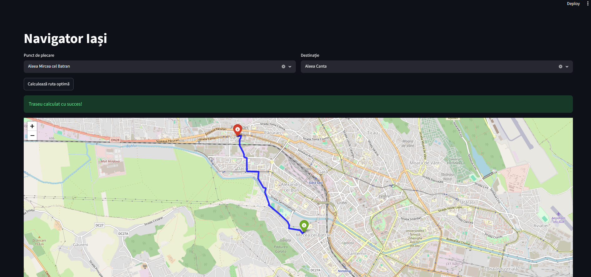
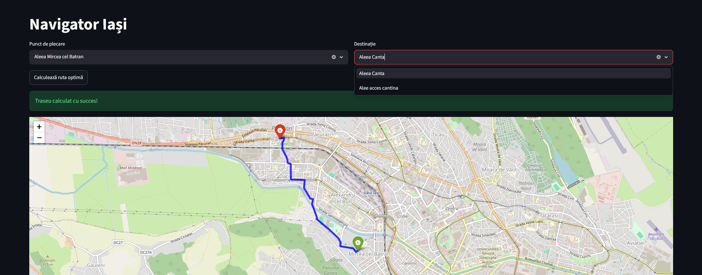

# City PathFinder
A hybrid, high-performance navigation system that calculates the shortest path between two street addresses using real-world data from OpenStreetMap.

Technologies Used:
- Backend/Engine: C++ (Dijkstra's Algorithm + Trie data structure for O(L) lookup)
- Frontend/Visualization: Python (Streamlit, Folium)
- Data Source: OpenStreetMap API (via OSMnx)

System Architecture :
This project follows a "Separation of Concerns" modular design:
1. Data Processing (`server.py`): Python extracts the street network from OSM and saves it into structured text files.
2. Web Interface (`web_app.py`): Provides an autocomplete-enabled UI and handles communication with the engine.
3. Computation Engine (`navigator.exe`): C++ loads the graph, performs a Trie-based name-to-ID lookup, and calculates the route using Dijkstra's algorithm.
4. Visualization: The computed path is mapped as an interactive Polyline.

How to run it:
1. Install requirements: ``pip install -r requirements.txt`
2. Download data: `python app/server.py`
3. Compile the C++ engine: 
   `g++ src/main.cpp src/graph.cpp src/Trie.cpp -o src/navigator.exe`
4. Start the web app: `python -m streamlit run app/web_app.py`
